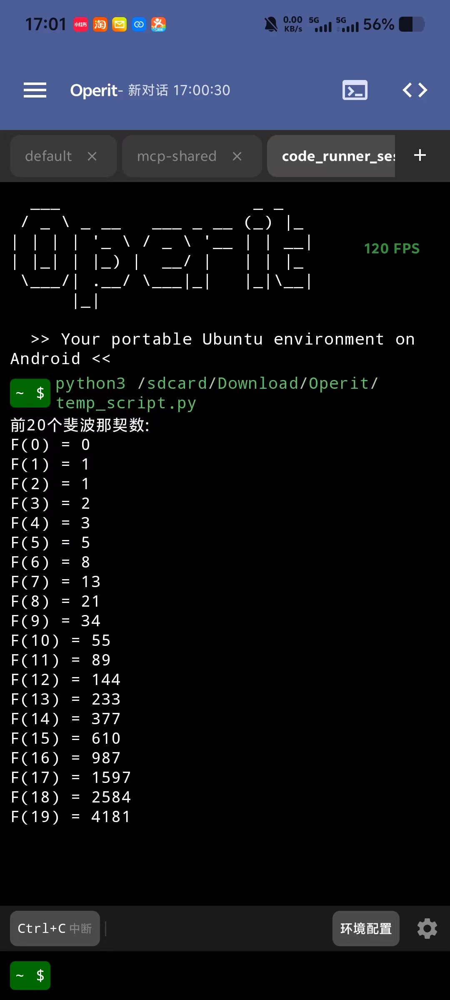
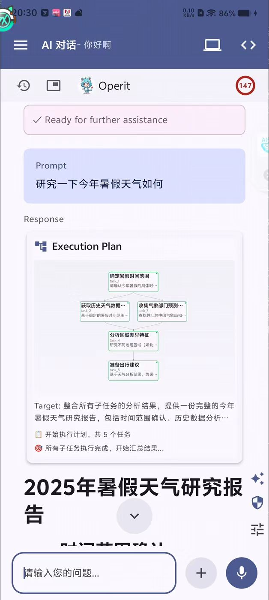
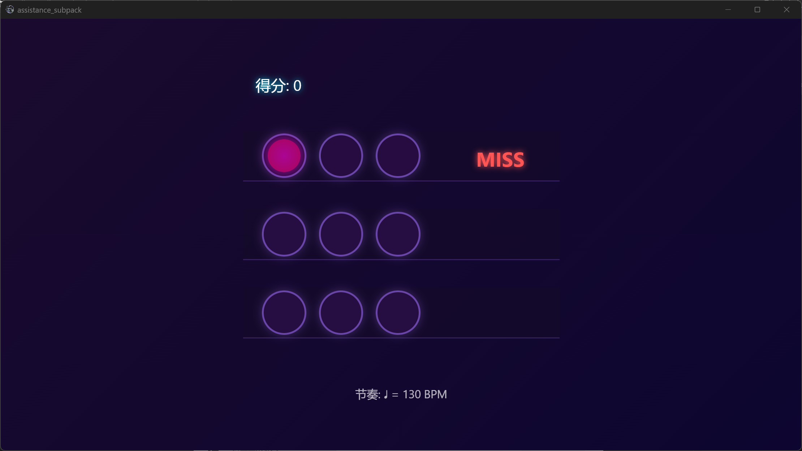
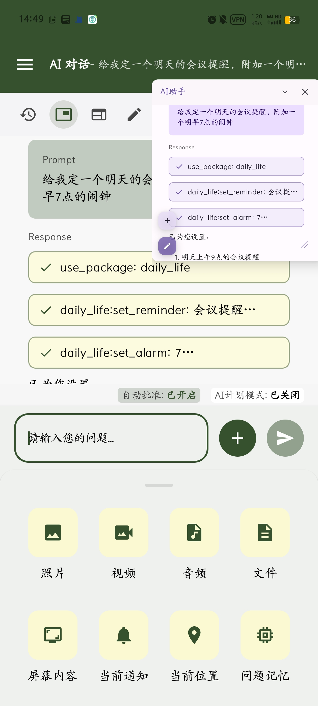
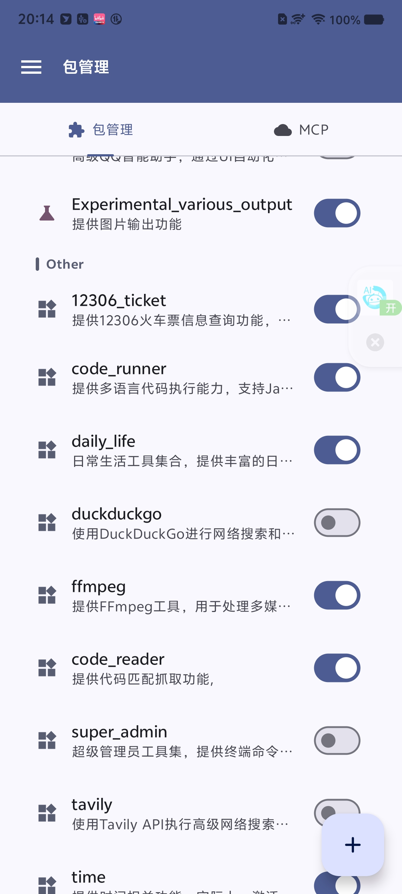

  中文 | <a href="README(E).md">English</a>

  
  
  
   
  
  
  
  
  
   
  
  
  
  

  
  <h1>Operit AI - 智能助手应用</h1>
  
📱 <b>移动端首个功能完备的AI智能助手应用，完全独立运行，拥有强大的工具调用能力</b> 📱

  

    
    
    
    
  

---

## 🌟 项目简介

**Operit AI** 是移动端首个功能完备的 AI 智能助手应用，完全独立运行于您的 Android 设备上（除API调用），拥有强大的**工具调用能力**、**深度搜索**、**工作流与自动化**、**智能记忆库**，并支持**人设定制**与**角色卡**等高度自定义功能，集成 **MNN/llama.cpp 本地模型**、**MCP/Skill 生态**与**多语言界面**。它不仅仅是聊天界面，更是与Android权限和各种工具深度融合的**全能助手**，内置**Ubuntu 24 环境**，提供前所未有的强大功能。

---

## ⚡ 核心亮点

<table>
<tr>
<td width="50%">

### 🖥️ Ubuntu 24 环境
内置完整 Ubuntu 24 系统，支持 vim、MCP、Python等工具，在手机上运行复杂的Linux命令和自动化任务

### 🧠 智能记忆系统
AI自动分类管理记忆，支持时间查询/导入导出/自动总结，智能搜索历史对话，记住您的偏好和习惯，提供个性化服务

### 🗣️ 语音交互
连续自然对话，支持本地/云端 TTS + 本地 STT、自定义音色、语音/特定音频唤醒、自动朗读

</td>
<td width="50%">

### 🤖 本地AI模型
支持 MNN / llama.cpp 本地模型（GGUF），完全离线运行AI，保护隐私数据

### 🎭 人设与角色卡
自定义AI性格、说话风格，支持角色卡导入导出（酒馆/JSON）/备份/二维码分享，角色卡可互聊并拥有独立对话历史

### 🔌 丰富工具生态
40+ 内置工具 + MCP/Skill 市场插件 + 工具包/工作流，含自动点击 Agent、绘图/图片搜索、AI 互聊/自我认知、定时任务、提示词市场等，覆盖文件操作、网络请求、系统控制、媒体处理

</td>
</tr>
</table>

---

## 🛠️ 功能速览

<b>📦 内置工具系统（点击展开）</b>

| 工具类型 | 功能说明 |
|---------|---------|
| 🐧 **Linux环境** | 完整Ubuntu 24，支持apt包管理、Python/Node.js运行环境、自定义软件源 |
| 📁 **文件系统** | 读写文件、搜索、解压缩、格式转换、Git集成 |
| 🌐 **网络工具** | HTTP请求、网页访问、文件上传下载、Web开发与导出 |
| ⚙️ **系统操作** | 安装应用、权限管理、无障碍 / ADB / Root 三通道自动化（含 AutoGLM 自动点击 Agent，支持 adb root 虚拟屏/多显示器） |
| 🎬 **媒体处理** | 视频转换、帧提取、OCR/图像理解、相机拍照、音视频读取 |
| 🧑‍💻 **开发与终端** | Web 工作区/一键打包、代码编辑/语法高亮、终端 SSH/Chroot/vim、Ctrl 组合键 |
| 🎨 **AI 创作** | 绘图工具包（OpenAI/Qwen/NanoBanana）、图片搜索/下载 |
| 🔍 **搜索引擎** | 深度搜索、DuckDuckGo、Tavily、谷歌学术、Bing、Sogou、Quark、百度地图集成 |
| 🧩 **工具包 & 工作流** | 工具包生态/包管理、工作流自动化、定时触发、语音唤醒触发 |

<b>🎨 界面定制（点击展开）</b>

- ✨ **主题系统**：自定义颜色、字体、间距、内边距
- 🌍 **多语言支持**：中英覆盖，自动随系统语言切换
- 🔤 **字体与排版**：全局字体大小、聊天边距自定义
- 🎭 **桌宠功能**：WebP动画支持、自定义表情、悬浮窗显示
- 📱 **布局优化**：隐藏状态栏、自定义工具栏、平板适配
- 🎨 **Markdown渲染**：LaTeX公式（支持左右滚动）、代码高亮、表格、Mermaid图表
- 🧾 **信息展示**：思考链折叠、HTML块预览、代码/思考块高度限制
- 🪟 **悬浮窗体验**：悬浮窗/气泡模式头像隐藏、圈选识屏、全屏预览
- 🧮 **数据统计**：Token 用量统计、模型饼图

<b>🔗 集成能力（点击展开）</b>

- 🤖 **Tasker集成**：触发自定义AI代理事件，深度自动化
- 🌐 **MCP/Skill 市场**：一键安装插件、远程MCP、自动描述、uvx/npx支持
- 🔌 **多模型支持**：OpenAI、Claude、Gemini、百灵、OpenRouter、LMStudio
- 🧪 **模型与提示词管理**：多配置/参数自定义、提示词市场
- 🔐 **权限系统**：工具级权限控制与安全提示
- 🔑 **密钥池与统计**：批量测试/导入、Token 统计（模型饼图）
- 🗂️ **工作区绑定**：支持 SAF / SFTP / SSH 工作区绑定与文件访问
- 🖱️ **自动点击 Agent**：AutoGLM + UI Tree 双通道，支持自动化操作
- 📊 **工具并行**：只读工具并行执行，提升响应速度

<b>💬 对话与记忆管理（点击展开）</b>

- 🧠 **记忆库**：自动分类/搜索、时间查询、导入导出、附件记忆
- 💬 **对话管理**：自动总结与总结编辑、历史分组/分支/迁移、对话锁定、角色卡独立历史
- ⚡ **对话并行**：并行对话处理、工具包 state 决策
- 🤖 **角色互动**：角色卡互聊、查看历史、思考链折叠
- 📦 **聊天记录**：多格式导入导出、历史备份与恢复

<b>💾 数据与备份（点击展开）</b>

- 🗂️ **全局/自动备份**：数据库定时备份，支持损坏恢复（排除 MCP/Skill/终端/包）
- 🎭 **角色卡**：备份、导出（酒馆/JSON）、二维码分享
- 🧷 **工作区**：SAF/SFTP/SSH 绑定、代码编辑/语法高亮、Git ignore
- 🧰 **Skill 管理**：Skill 开关、仓库解析与缓存下载

---

## 📸 功能展示

<table>
<tr>
<td align="center" width="33%">
 
<b>Web开发</b> 
在手机上设计网页并导出为独立应用
</td>
<td align="center" width="33%">
 
<b>悬浮窗 & 附件</b> 
随时调用，便捷分享
</td>
<td align="center" width="33%">
 
<b>插件市场</b> 
丰富的MCP生态
</td>
</tr>
</table>

---

## 🚀 快速开始

| 项目 | 说明 |
|-----|------|
| 📋 **系统要求** | Android 8.0+ (API 26+)，建议 4GB+ 内存，200MB+ 存储 |
| 📥 **下载安装** | [Release页面](https://github.com/AAswordman/Operit/releases) 下载最新APK |
| 📖 **使用指南** | [完整文档](https://aaswordman.github.io/OperitWeb) 包含详细教程和示例 |

> **安全提示：** 为确保您的数据安全，请务必从官方 [Release页面](https://github.com/AAswordman/Operit/releases) 或 [官方网站](https://aaswordman.github.io/OperitWeb/) 下载本应用。通过未知渠道下载的安装包可能被恶意修改，从而导致隐私泄露或设备被监听。

**安装步骤：** 下载APK → 安装启动 → 按引导配置 → 开始使用 ✨

---

## 🔮 TODO / 开发计划

- **UI 自动化与截图管线**  
  - ✅ 已支持无障碍 / ADB / Root 三种权限模式的 UI 自动化
  - ✅ 支持 adb root 场景下的虚拟屏幕/多显示器（`display` 参数）
  - ✅ UI Tree 支持 AutoGLM + 本地 uiautomator dump 双方案

---

## 📅 版本更新历程

<table>
<tr><th>版本</th><th>发布日期</th><th>核心更新</th></tr>

<tr>
<td><b>v1.10.1</b> 最新</td>
<td>2026-04-17</td>
<td>
• <b>内置浏览器与网页自动化</b>：大幅增强内置浏览器，支持标签页、历史、书签、权限、多窗口、最小化与视口控制，并补齐浏览器脚本的导入、安装、启停、存储与页面菜单能力 
• <b>虚拟形象与界面定制</b>：支持 FBX 虚拟形象并升级 MMD 预览，新增液态玻璃主题效果，并增强侧边栏、聊天气泡与输入栏的外观自定义 
• <b>插件、工作区与上下文增强</b>：支持通过配置编辑器调试和自动编写 Operit 插件，新增本地 HTTP 对话入口、工作区重命名与规则文件自动读取，并增强历史跳转、双向分页与上下文自动补充能力 
• <b>稳定性与性能优化</b>：修复工具权限、HTTP TTS、SSH/tmux 长输出、历史跳转、GIF/公式/Markdown 渲染、MCP 配置与统计等问题，并持续优化对话链路、深度搜索、记忆系统、浏览器与包管理器
</td>
</tr>

<tr>
<td><b>v1.10.0</b></td>
<td>2026-03-18</td>
<td>
• <b>角色卡群聊与 AI 自配置</b>：支持多个角色卡群聊与 @ 交互，新增 AI 自我设置能力，可辅助配置 MCP、Skill、STT、TTS 与模型参数 
• <b>主题与交互升级</b>：新增分组折叠消息、气泡主题及字体/颜色/背景自定义、更宽气泡、输入框液态玻璃、长按图标直达设置/语音模式，以及助手形象与 MP4 虚拟形象支持 
• <b>工具与平台扩展</b>：新增 Ollama、NVIDIA、OpenAI Response 通用模式，补充独立 SSH 插件工具包、Java Bridge、APKTool 插件、Web 自动化下载、Markdown 音视频渲染、xAI 视频生成、工作流取消、终端自定义按键与消息队列 
• <b>修复与性能优化</b>：修复语音识别、记忆并发、悬浮窗交互、终端显示、Web 自动化全屏、MNN Tool Call 等问题，并优化记忆召回、市场搜索、工作区模板、grep 工具性能与 Agent 重试稳定性
</td>
</tr>

<tr>
<td><b>v1.9.1</b></td>
<td>2026-02-20</td>
<td>
• <b>稳定性修复</b>：集中修复 1.9.0 多项问题，提升整体可用性与流畅性 
• <b>终端与工具调用</b>：增强终端工具，修复交互 UI 卡住、严格工具调用历史工具报错、Windows 控制器 raw 命令执行问题 
• <b>MCP 与记忆库</b>：修复远程 MCP 无法关闭，重做记忆库写入逻辑，支持外接向量模型并新增连接修改工具 
• <b>功能补充与界面修复</b>：新增未绑定角色卡聊天记录删除、工作流批量删除与执行日志查看，修复输入法/暗色输入框/主题透明度/工具箱包管理等问题
</td>
</tr>

<tr>
<td><b>v1.9.0</b></td>
<td>2026-02-17</td>
<td>
• <b>移动端网页自动操作</b>：新增网页操作能力，支持工作区 Web 项目 CORS 绕过访问外部网页 
• <b>Windows 终端操作</b>：支持 Windows 命令操作，可控制 Codex 等 CLI，新增严格工具调用模式补充兼容性 
• <b>工具与系统扩展</b>：新增 SQL 查看器、Android 工作区模板、OpenAI response 兼容供应商、skill 直接输入添加、统计饼图 
• <b>修复与优化</b>：修复图片读取/上下文总结/特殊符号截断/ffmpeg 等问题，增强模型连通性测试输出与 MCP 加载提示
</td>
</tr>

<tr>
<td><b>v1.8.1</b></td>
<td>2026-02-03</td>
<td>
• <b>llama.cpp 本地推理</b>：支持 GGUF 本地模型与相关工具 
• <b>工具与界面</b>：图片搜索/下载、HTML 块预览、代码/思考块高度限制、气泡头像隐藏、Token 饼图、思考链折叠 
• <b>数据与备份</b>：全局备份（排除 MCP/skill/终端/包）+ 角色卡备份/导出/分享、Skill 开关、密钥池导入/批量测试、工作区支持 SAF 绑定 
• <b>修复</b>：AI 朗读回声录制、悬浮窗 Token 统计、角色编辑键盘遮挡、深搜 Token 爆炸、MCP 启动、工作流悬浮窗退出、表格截断、硅基流动语音打断
</td>
</tr>

<tr>
<td><b>v1.8.0</b></td>
<td>2026-01-13</td>
<td>
• <b>工作流系统</b>：支持计算/传入传出/执行等能力，并支持语音唤醒触发 
• <b>语音唤醒</b>：直接进入语音对话模式，支持语音下关键词快速附件附着 
• <b>对话并行</b>：支持对话并行处理，工具包 state 机制可动态决定工具 
• <b>新增与优化</b>：记忆时间查询、自动备份、OpenAI 绘图/语音供应商、MCP 启动优化、终端 chroot、修复多项 BUG
</td>
</tr>

<tr>
<td><b>v1.7.1</b></td>
<td>2025-12-31</td>
<td>
• <b>Root 虚拟屏幕自动化</b>：支持 root 启动虚拟屏幕，AutoGLM 并发多窗口任务 
• <b>Skill 生态</b>：新增 Skill 协议与 Skill 市场，并支持 BETA 计划追踪 nightly 
• <b>交互增强</b>：总结编辑、网页访问改悬浮窗模式、圈选识屏、对话锁定 
• <b>修复与优化</b>：大图崩溃、ToolCall 错误、代码块换行、启动速度与虚拟屏稳定性
</td>
</tr>

<tr>
<td><b>v1.7.0</b></td>
<td>2025-12-19</td>
<td>
• <b>GUI 自动化里程碑</b>：Autoglm + 虚拟屏幕（可在设置中开关虚拟屏幕） 
• <b>自动化增强</b>：一键 Autoglm 配置与单独执行器，虚拟屏开关逻辑与截图质量自定义 
• <b>体验优化</b>：密钥非聚焦显示为星号，强制不允许 Autoglm 设置为主模型 
• <b>工具扩展</b>：NanoBanana 绘图包、apply file 非覆盖支持、MNN STT 等
</td>
</tr>

<tr>
<td><b>v1.6.3</b></td>
<td>2025-12-08</td>
<td>
• <b>原生ToolCall支持</b>：支持原生模型工具调用、DeepSeek思考工具 
• <b>工作区与终端增强</b>：新建时选择项目类型、SSH文件系统连接、终端无障碍支持 
• <b>模型与消息显示</b>：支持模型配置多选、消息显示模型名称与提供者 
• <b>优化与修复</b>：优化悬浮窗、修复终端卡顿、迁移工作区到内部存储
</td>
</tr>

<tr>
<td><b>v1.6.2</b></td>
<td>2025-11-20</td>
<td>
• <b>对话管理增强</b>：长按开分支、历史记录分类显示、批量迁移 
• <b>模型配置优化</b>：配置重命名、上下文绑定、谷歌原生搜索 
• <b>Bug修复</b>：界面切换、粗体换行、气泡模式等问题 
• 增加crossref学术论文检索包、升级代码编辑器
</td>
</tr>

<tr>
<td><b>v1.6.1</b></td>
<td>2025-11-05</td>
<td>
• <b>性能大优化</b>：重做UI绘制，大幅提升流畅性 
• <b>AI视觉增强</b>：直接识别图片、间接识别能力 
• <b>终端SSH</b>：支持SSH连接和反向挂载手机文件系统 
• 自动总结机制、深度搜索、新授权系统
</td>
</tr>

<tr>
<td><b>v1.6.0</b></td>
<td>2025-10-21</td>
<td>
• <b>MNN本地模型</b>支持 
• <b>记忆库大更新</b>：AI自动分类、智能搜索、导入导出 
• <b>终端优化</b>：vim支持、进度条、自定义软件源 
• Tasker集成、桌宠功能、故事线标签
</td>
</tr>

<tr>
<td><b>v1.5.2</b></td>
<td>2025-10-05</td>
<td>
• MCP增强：uvx/npx支持、启动加速 
• 工作区 Git ignore 
• 相机拍照、HTML渲染、正则过滤
</td>
</tr>

<tr>
<td><b>v1.5.0</b></td>
<td>2025-09</td>
<td>
• <b>Ubuntu 24终端</b>完整集成 
• MCP市场上线 
• 桌宠功能、深度搜索模式
</td>
</tr>

<tr>
<td><b>v1.4.0</b></td>
<td>2025-08</td>
<td>
• 多工具并行执行 
• 人设卡系统、角色选择器 
• PNG角色卡导入
</td>
</tr>

<tr>
<td><b>v1.3.0</b></td>
<td>2025-08</td>
<td>
• Web开发功能 
• 主题选择器、自定义UI 
• Anthropic Claude支持
</td>
</tr>

<tr>
<td><b>v1.2.x</b></td>
<td>2025-07</td>
<td>
• 语音对话系统 
• 知识库功能 
• DragonBones动画支持
</td>
</tr>

<tr>
<td><b>v1.1.x</b></td>
<td>2025-06</td>
<td>
• MCP协议支持 
• OCR识别、悬浮窗 
• Gemini完整支持
</td>
</tr>

<tr>
<td><b>v1.0.0</b></td>
<td>2025-05</td>
<td>
• 首个正式版本 
• 基础AI对话、工具调用 
• Shizuku/Root集成
</td>
</tr>
</table>

> 📝 **完整更新日志**：访问 [Releases 页面](https://github.com/AAswordman/Operit/releases) 查看每个版本的详细更新内容

---

## 👨‍💻 开源共创

欢迎加入 Operit 开源生态！我们欢迎各种贡献：第三方脚本、MCP插件、核心功能开发。

**开发者须知：**
- 📚 [开源共创指南](docs/CONTRIBUTING.md) | [脚本开发指南](docs/SCRIPT_DEV_GUIDE.md)
- 📦 构建项目需从 [Google Drive](https://drive.google.com/drive/folders/1g-Q_i7cf6Ua4KX9ZM6V282EEZvTVVfF7?usp=sharing) 下载依赖库压缩包（`models.zip`、`subpack.zip`、`jniLibs.zip`、`libs.zip`）
- 💬 加入社区讨论：[QQ群](https://qm.qq.com/q/Sa4fKEH7sO) | [Discord](https://discord.gg/YnV9MWurRF)

### 💖 贡献者

感谢所有为 Operit AI 做出贡献的人！

## 💖 支持开发

如果 Operit AI 对您有帮助，欢迎自愿支持项目持续开发与基础运营：

- 海外支持可使用 [Patreon](https://www.patreon.com/c/aaswordsman)
- 境内支持可使用 [爱发电](https://afdian.com/a/aaswordsman)

- 赞助完全自愿，不与任何功能、额度、更新、答疑或其他权益挂钩
- 即使不赞助，也不影响正常使用、获取更新或访问开源代码
- 您也可以直接使用 GitHub 仓库顶部的 `Sponsor` 按钮进入赞助页面

---

## 📄 许可证

本项目采用 [GNU LGPLv3](https://www.gnu.org/licenses/lgpl-3.0.html) 许可证。

简单来说，这意味着：
- 您可以自由地使用、修改和分发本项目的代码。
- 如果您修改了代码并进行分发，您也必须以 LGPLv3 许可证开源您修改过的部分。
- 详细信息请参阅 [LICENSE](LICENSE) 文件。

---

## 📝 问题反馈

遇到问题或有建议？欢迎 [提交 Issue](https://github.com/AAswordman/Operit/issues)！

**提交指南：**
- 📝 清晰描述问题/建议，提供复现步骤
- 📱 附上设备型号、系统版本等信息
- 📸 如有可能，提供截图或录屏

---

  <h3>⭐ 如果觉得项目不错，请给我们一个 Star ⭐</h3>
  
<b>🚀 帮助我们推广，让更多人了解 Operit AI 🚀</b>

  
   
  
  Made with ❤️ by the Operit Team

